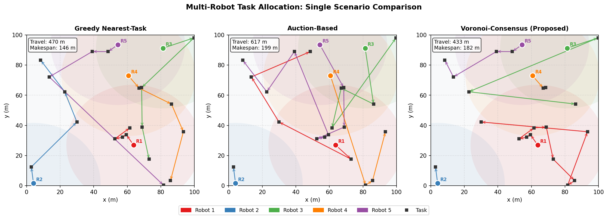
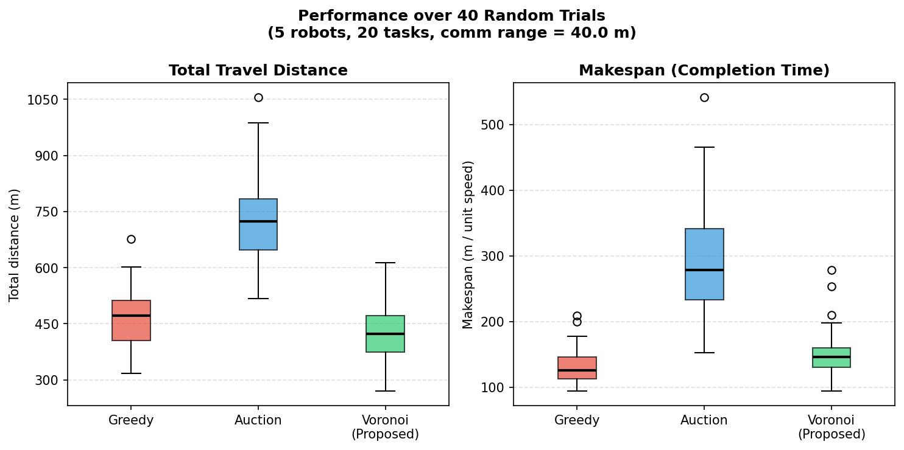
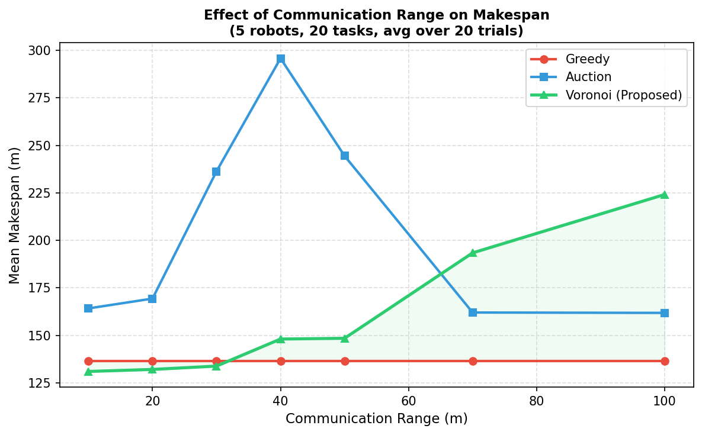
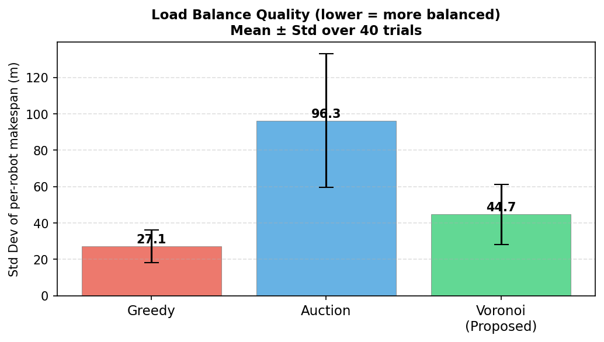

# Multi-Robot Task Allocation under Communication Constraints


A simulation study comparing three distributed task allocation strategies for multi-robot systems operating under **range-limited communication constraints**.

---

## Overview

In real-world multi-robot deployments — UAV-based inspection, search-and-rescue, environmental monitoring — robots must divide tasks among themselves while communicating over limited-range radios. Classical methods assume full connectivity and break down when the communication graph is sparse.

This project proposes and evaluates a **Voronoi-Consensus** allocation method that:
- Exploits spatial structure via Voronoi partitioning *(zero communication required)*
- Rebalances workload via a single round of one-hop message passing along the communication graph
- Degrades gracefully as communication range decreases

### Methods Compared

| Method | Communication Required | Key Idea |
|---|---|---|
| Greedy Nearest-Task | None | Each robot picks closest unassigned task in turn |
| Auction-Based | Multi-hop broadcast | Robots bid on tasks; lowest-cost bidder wins |
| **Voronoi-Consensus (Proposed)** | **One-hop only** | **Voronoi partition + local rebalancing** |

---

## Results (40 Monte Carlo Trials)

| Method | Travel Distance (m) | Makespan (m) | Load Std Dev (m) |
|---|---|---|---|
| Greedy Nearest-Task | 469 ± 72 | 132 ± 26 | 27 ± 9 |
| Auction-Based | 727 ± 117 | 291 ± 82 | 96 ± 37 |
| **Voronoi-Consensus** | **427 ± 79** | 151 ± 37 | 45 ± 17 |

Voronoi-Consensus achieves the **lowest total travel distance** and **best robustness to communication loss**.

---

## Figures

<table>
  <tr>
    <td><br><sub>Single-scenario task allocation paths</sub></td>
    <td><br><sub>Travel distance & makespan distributions</sub></td>
  </tr>
  <tr>
    <td><br><sub>Makespan vs. communication range</sub></td>
    <td><br><sub>Load balance quality across trials</sub></td>
  </tr>
</table>

---

## Installation

```bash
git clone https://github.com/<your-username>/multi-robot-task-allocation.git
cd multi-robot-task-allocation
pip install -r requirements.txt
```

---

## Usage

```bash
python simulation.py
```

This will:
1. Run 40 Monte Carlo trials across all three methods
2. Print a summary table to the terminal
3. Save 4 figures (`fig1_scenario.png` through `fig4_load_balance.png`) in the current directory

### Configuration

Edit the constants at the top of `simulation.py` to customise the experiment:

```python
AREA       = 100.0   # Environment size (m)
N_ROBOTS   = 5       # Number of robots
N_TASKS    = 20      # Number of tasks
COMM_RANGE = 40.0    # Communication radius (m)
N_TRIALS   = 40      # Monte Carlo trials
```

---

## Mathematical Formulation

The task allocation is formulated as:

$$\sigma^* = \underset{\sigma}{\arg\min}\ T_{\max}(\sigma) \quad \text{s.t. coordination uses only edges in } G$$

where the **makespan** is:

$$T_{\max}(\sigma) = \max_{i=1,\ldots,N}\ C_i(\sigma)$$

and the **travel cost** for robot $i$ is:

$$C_i(\sigma) = \|\mathbf{r}_i - \mathbf{t}_{i,1}\|_2 + \sum_{\ell=1}^{|\Pi_i|-1} \|\mathbf{t}_{i,\ell} - \mathbf{t}_{i,\ell+1}\|_2$$

The **communication graph** $G = (V, E)$ is defined by:

$$( i,\, k) \in E \iff \|\mathbf{r}_i - \mathbf{r}_k\|_2 \leq d_{\text{comm}}$$

See [`report/report.pdf`](report/report.pdf) for the full mathematical treatment.

---

## Project Structure

```
multi-robot-task-allocation/
├── simulation.py        # Main simulation — all three methods + Monte Carlo
├── requirements.txt     # Python dependencies
├── figures/             # Generated output figures
│   ├── fig1_scenario.png
│   ├── fig2_boxplots.png
│   ├── fig3_comm_range.png
│   └── fig4_load_balance.png
└── report/
    ├── report.tex       # LaTeX source
    └── report.pdf       # Compiled report
```

---

## Relation to Prior Work

This project is inspired by and submitted as a research task for Prof. Mingyu (Ben) Kim's lab at Georgia Southern University, in response to his work on stochastic sensor placement for barrier coverage systems:

> M. Kim, D. J. Stilwell, H. Yetkin, and J. Jimenez, *"Near-optimal sensor placement for detecting stochastic target trajectories in barrier coverage systems,"* IEEE SysCon, 2025.

The proposed Voronoi-Consensus method draws conceptual connections to the spatial partitioning and stochastic optimization ideas in that work, extending them toward multi-robot coordination.

---

## Possible Extensions

- **Online task allocation** — dynamically discovered tasks with online rebalancing
- **Stochastic task locations** — model tasks as a spatial point process (LGCP), bridging sensor placement and task allocation
- **Formal guarantees** — derive an approximation ratio bound for Voronoi-Consensus under partial connectivity
- **ROS2 implementation** — hardware validation on TurtleBot 3 or UAV simulators

---

## Dependencies

- Python 3.8+
- numpy
- matplotlib
- scipy
- scikit-learn

---

## License

MIT License — free to use, modify, and distribute with attribution.

---

## Author

**[Your Full Name]**
B.Tech in Electronics and Communication Engineering
[Your University]
[your.email@example.com] · [LinkedIn] · [GitHub]
